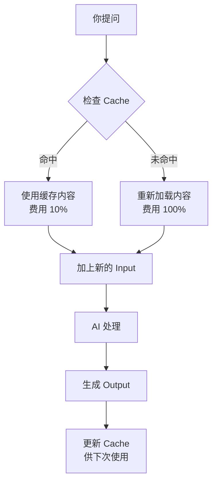

# token input、output 及 cache 关系

## 🎯 核心关系：一个图书馆的比喻

把 Claude Code 想象成一个**有记忆的图书馆**，你每次提问就像**去咨询图书管理员**。

---

## 📚 三个角色的定位

| 概念 | 图书馆比喻 | 技术含义 | 谁付钱 |
|------|-----------|----------|--------|
| **Input** | 你这次问的问题 + 你推给管理员的书 | 本次请求新发送的内容 | ✅ 付钱 |
| **Cache** | 管理员上次帮你查过的书（放在桌面备查） | 历史会话中已加载过的内容 | 💰 **极便宜**（≈1/10价格） |
| **Output** | 管理员给你的答案 | AI 生成的内容 | ✅ 付钱 |

---

## 🔄 它们如何协同工作

### 场景 1：第一次提问
```
你：“帮我分析 auth.js 文件”（Input: 100 tokens）
管理员：翻看 auth.js（Cache: 0，因为第一次）
管理员：“这个文件负责用户登录...”（Output: 50 tokens）

费用 = Input(100) + Output(50)  ← Cache 为 0
```

### 场景 2：第二次提问（同一会话）
```
你：“那给登录函数加个验证”（Input: 20 tokens，只说了新需求）
管理员：auth.js 还在桌面上（Cache: 100 tokens，复用！）
管理员：“好的，我添加了验证代码...”（Output: 200 tokens）

费用 = Input(20) + Output(200) + Cache(100×0.1倍)
     = 你只付了新问题的钱 + 答案的钱 + 缓存内容的 1/10 费用
```

### 场景 3：你当前的会话
```
你的 Input: 1.4M（每次提问都重新推送整个对话历史）
你的 Cache: 5.8M（但命中率只有 80%，说明 20% 没命中）
你的 Output: 63.8k

问题：Input 太大，而且有 1.16M（5.8M × 20%）的缓存浪费
```

---

## 📊 三者关系的数学本质

```
总处理量 = Input + Cache + Output
费用 = Input×P_input + Cache×P_cache + Output×P_output

其中：P_cache ≈ P_input × 0.1（缓存便宜 90%）
```

**你的数据代入**：
```
总处理量 = 1.4M + 5.8M + 63.8k = 7.26M tokens
费用 ≈ 1.4M×1 + 5.8M×0.1 + 63.8k×1 = 1.4M + 0.58M + 0.064M = 2.04M token-equivalent

但如果没缓存：7.26M × 1 = 7.26M token-equivalent
节省比例 = (7.26 - 2.04) / 7.26 ≈ 72%
```

**结论**：缓存让你节省了 **72% 的费用**，但因为 Input 仍然太大，绝对费用还是高。

---

## 🎨 可视化关系图

```
第一次提问：
┌─────────────────────────────────────┐
│ Input: 100 ████████                  │
│ Cache:   0                           │
│ Output: 50 ████                      │
└─────────────────────────────────────┘

第二次提问（有缓存）：
┌─────────────────────────────────────┐
│ Input: 20 █                          │
│ Cache: 100 ████████ (便宜 90%)       │
│ Output: 200 ████████████████         │
└─────────────────────────────────────┘

你的当前会话（比例严重失调）：
┌─────────────────────────────────────┐
│ Input: 1.4M ████████████████████     │
│ Cache: 5.8M ████████████████████████ │
│ Output: 63.8k █                      │
└─────────────────────────────────────┘
问题：Output 太少，说明 AI 大部分时间在“读”而不是“写”
```

---

## ⚙️ 实际工作流程



---

## 🛠️ 如何利用这个关系优化成本和速度

### 黄金法则
1. **最大化 Cache 命中率**：保持在同一个会话中工作，不要频繁 `/clear`
2. **最小化 Input**：用 `/compact` 压缩历史，而不是每次都推全部
3. **平衡 Input/Output**：如果你只是在“读”而不是“写”，成本效率很低

### 你当前的问题
```
Input 太大 + Cache 命中率下降（80%）+ Output 太少
↓
AI 花了 40 分钟阅读 7M tokens，只写出 63.8k tokens
↓
相当于读了 110 本书，只写出 3 页笔记
```

### 优化目标
```
理想状态：
Input : Output = 5:1 到 10:1
Cache 命中率 > 90%
Input < 500k（压缩后）

你的目标：
Input 1.4M → 200k（用 /compact）
Cache 命中率 80% → 95%（减少上下文切换）
```

---

## 💡 一句话总结

> **Input 是你给 AI 的“材料”，Cache 是 AI 记住的“旧材料”（便宜 90%），Output 是 AI 给你的“成品”。你的问题是材料太多（1.4M）、成品太少（63.8k），AI 大部分时间在搬砖而不是盖房子。**

下次执行 `/compact` 后，再看 `/cost`，你会发现 Input 骤降，Cache 命中率回升，费用大幅下降。
